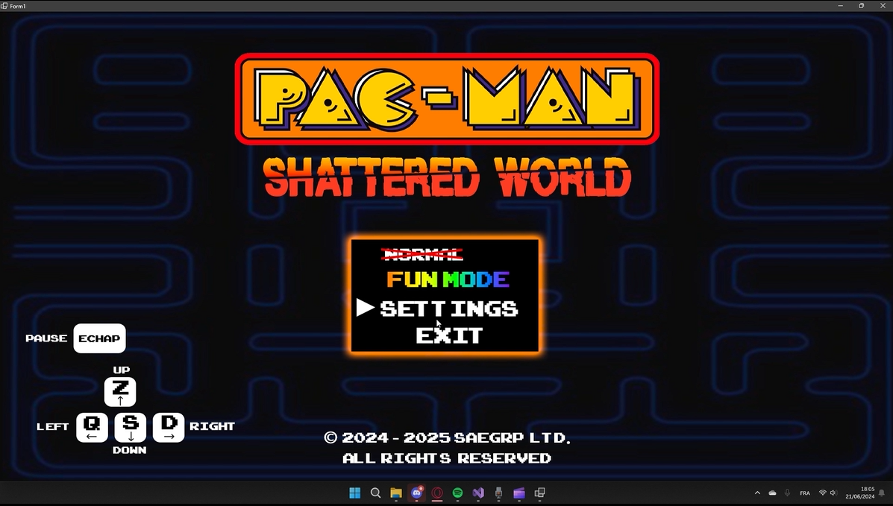
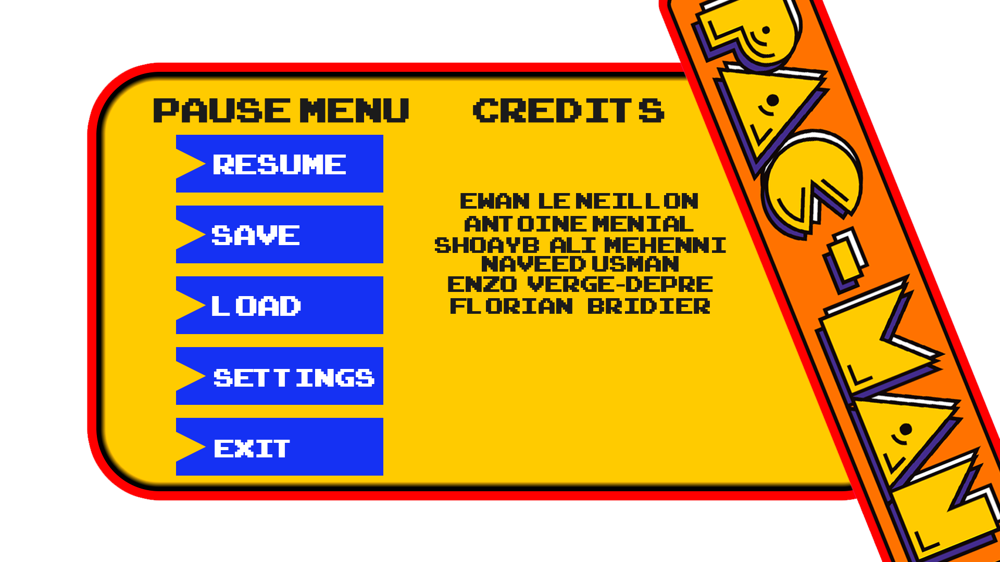
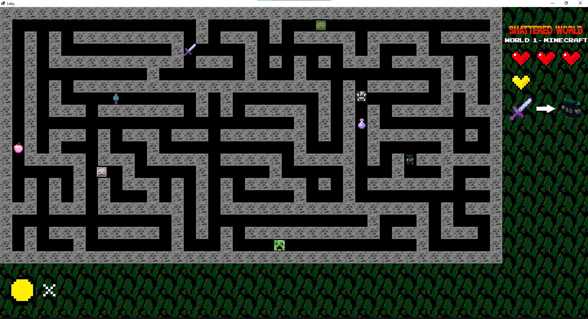
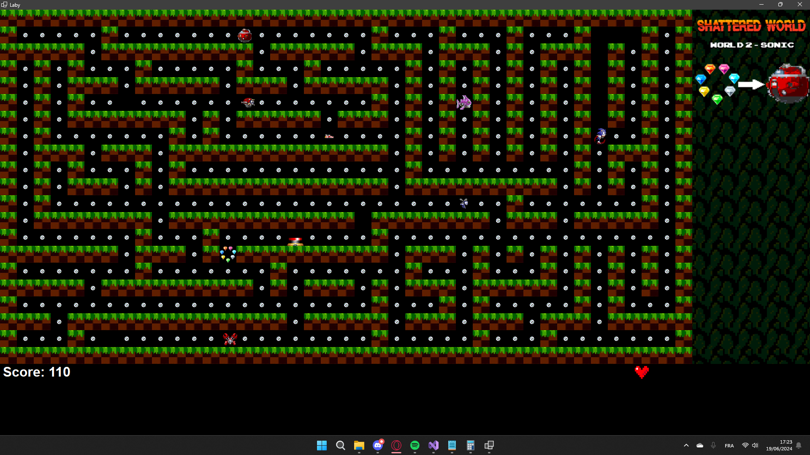

# Pac-Man Shattered World

Documentation d’un projet universitaire de jeu vidéo réalisé en équipe.

Pac-Man Shattered World est une revisite du jeu Pac-Man développée en C# avec WinForms et .NET.  
Le concept repose sur plusieurs mondes inspirés d’univers vidéoludiques différents, avec une logique de déplacement, de collisions, de score, d’ennemis et d’algorithmes de graphes.

> Note : le code source du projet n’est plus disponible. Ce dépôt regroupe la documentation, les captures et l’explication technique du projet.

---

## Concept

Le projet consiste à proposer plusieurs niveaux de Pac-Man, chacun inspiré d’un univers vidéoludique différent :

- Minecraft
- Sonic
- FIFA
- Mario
- Zelda
- Doom

Chaque monde possède ses propres objectifs, bonus, ennemis et règles de progression.

---

## Fonctionnalités prévues / développées

- Gestion des déplacements du joueur
- Gestion des collisions
- Système de score
- Gestion des vies
- Menu principal
- Pause
- Fin de partie
- Plusieurs mondes de jeu
- Logique de déplacement des ennemis

---

## Algorithmes et notions techniques

Le projet intégrait des notions d’algorithmique et de graphes :

- Algorithme de Dijkstra pour le pathfinding
- Parcours eulérien
- Modélisation de la carte sous forme de graphe
- Calcul de chemins pour les ennemis
- Gestion des états du jeu
- Programmation orientée objet

---

## Technologies

- C#
- .NET
- WinForms
- Programmation orientée objet
- Algorithmes de graphes

---

## Aperçu

  

### Menu pause

  

### Monde Minecraft

  

### Monde Sonic

  

---

## Ce que ce projet m’a apporté

Ce projet m’a permis de travailler sur la conception d’un jeu en C#, avec une logique orientée objet et une gestion d’états de jeu.

Il m’a également permis d’appliquer des notions d’algorithmique à un cas concret, notamment avec les graphes, Dijkstra et le pathfinding des ennemis.

Enfin, le projet a renforcé mes compétences en travail d’équipe, conception fonctionnelle, découpage de fonctionnalités et présentation technique.

---

## Statut du dépôt

Ce dépôt sert de trace documentaire du projet.

Le code source n’est plus disponible, mais la documentation permet de présenter le concept, les choix techniques et les compétences mobilisées.
